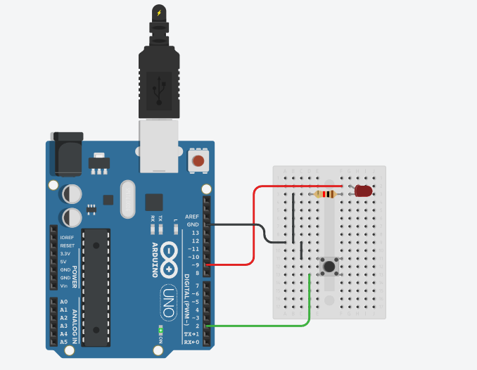

# Arduino Button-Controlled LED Project

This project demonstrates how to control an LED using a push button and an Arduino UNO. When the button is pressed, the LED turns on. When the button is released, the LED turns off.

## Components Used

- Arduino UNO
- Breadboard
- 1x LED (Red)
- 1x 220Ω Resistor
- 1x Push Button
- Jumper Wires

## Circuit Diagram



## How It Works

- The push button is connected to digital pin 2.
- The LED is connected to digital pin 10 through a 220Ω resistor.
- When the button is pressed, pin 2 reads HIGH, and pin 10 is set to HIGH, turning on the LED.

## Arduino Code

```cpp
int ledPin = 10;
int buttonPin = 2;
int buttonState = 0;

void setup() {
  pinMode(ledPin, OUTPUT);
  pinMode(buttonPin, INPUT);
}

void loop() {
  buttonState = digitalRead(buttonPin);

  if (buttonState == HIGH) {
    digitalWrite(ledPin, HIGH);
  } else {
    digitalWrite(ledPin, LOW);
  }
}
